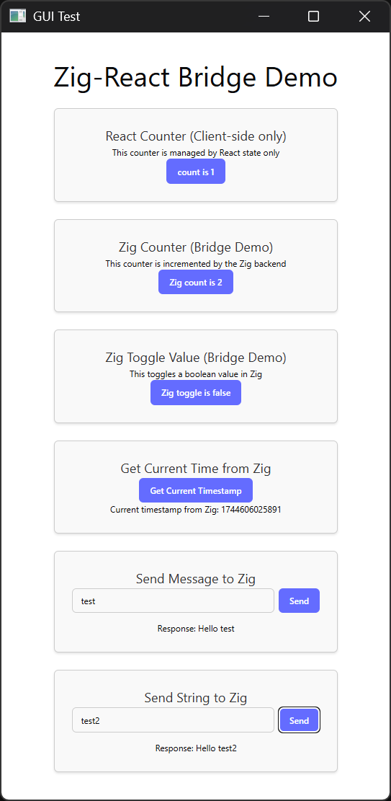

# Zig GUI Test

## Project Overview
This is a GUI application built with Zig programming language that uses WebView for rendering a web-based UI. The frontend is built with React, TypeScript, and Tailwind CSS using the shadcn/ui component library.

## Repository Structure

### Backend (Zig)
- **src/main.zig**: Entry point for the executable that creates a WebView instance
- **src/root.zig**: Library root file with basic functionality
- **build.zig**: Build configuration for the Zig project
- **build.zig.zon**: Package dependencies configuration (uses webview-zig from a local path)

### Frontend (React/TypeScript)
- **ui/**: Main UI implementation using React 19, TypeScript, and Tailwind CSS
  - Uses Vite as the build tool
  - Implements shadcn/ui component library
  - Uses the "new-york" style from shadcn/ui
  - Uses Lucide for icons

## Dependencies
- **Backend**: 
  - webview-zig (from local path "../webview-zig")
  
- **Frontend**:
  - React 19
  - TypeScript
  - Tailwind CSS 4
  - shadcn/ui components
  - Vite 6
  - Lucide icons

## Build System
- Zig build system for the backend
- Vite for the frontend
- The project creates both a static library and an executable

## Development Workflow
1. Build the Zig application: `zig build`
2. Run the application: `zig build run`
3. Develop the UI: `cd ui && bun run dev`
4. Build the UI: `cd ui && bun run build`

## Testing
- Zig tests can be run with: `zig build test`
- The project includes test setup for both the library and executable components
